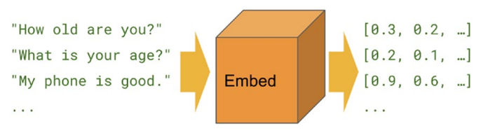

# 📃 SENTIMENT ANALYSIS OF AMAZON MOVIE REVIEWS DATA USING TENSORFLOW :scroll:
 
## Machine Learning

<div align="center"><p><i>An algorithm that can read?</i>:fearful:</p></div>

This project involves some basic step-by-step command lines we can find in any **machine learning** algorithm but that still can show us how powerful is the standard paradigm of machine learning algorithms. 

We are going to use the average well known protocol of **machine learning** that is basically the loading of some data and the cleaning and model application upon it. We may use a tokenizer also. Then, we are going to save the model.

## Neural Networks

For this type of work, we may use **Neural Netwoks**, that are specially apt for abstract works. And we'll use LSTM achitecture for the network, as other specific technologies for text interpretation as tokenizers and embeddings. Above we can see the LSTM format for neural nets:

<div align="center"><p><i>LSTM architecture for neural networks</i></p></div>

...which goes like this in code:

```
# Create Model
model = Sequential()
model.add(Embedding(total_size, 20, input_length=max_length))
# LSTM architecture
model.add(LSTM(32,dropout=0.2, recurrent_dropout=0.2))
model.add(Dense(1, activation='sigmoid'))
```

### Tokenizers

Tokenizers are a technology that take textual arrays and share it into 'pieces' with semantic value. Then it turns out to set a numeric value for each token and rescue this value when find similar tokens later through embedding process.

Tokenizers in code goes like:

```
# tokenizer
tokenizer = Tokenizer()
tokenizer.fit_on_texts(x_train) # x_train is our train text
word_index=tokenizer.word_index
# Now we count how many tokens we had:
total_size = len(word_index)+1
print(total_size)
```

Pretty simple.

### Embedding

Embedding is the process of vectorization of tokens. It's like stretching a vector from a token to tokens around and then establishing semantical conections among them. 

<div align="center"><p><i>Embedding works as a layer of a LSTM network</i></p></div>

We all this technologies it becomes perfect possible to build a machine learning algorithm that can interpret a text and even write their own one. Scary:frowning:!
